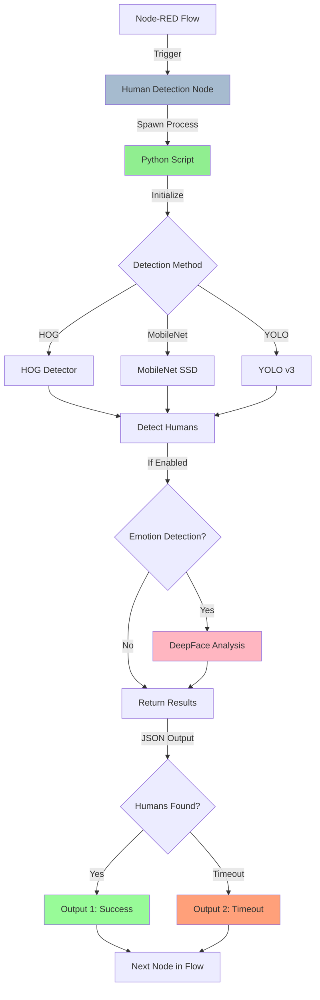

# Human Detection & Emotion Recognition Node for Pepper Bot

This Node-RED node enables real-time human detection and facial emotion recognition using Python and OpenCV, designed for the Pepper robot but works with any camera source.

## Architecture



## Features

- **Multiple Detection Methods**:
  - **HOG (Histogram of Oriented Gradients)**: Fast, CPU-friendly, ideal for simple scenarios
  - **MobileNet SSD**: Balanced performance and accuracy using deep learning
  - **YOLO**: Most accurate detection with real-time performance

- **Facial Emotion Recognition** (Optional):
  - Detects 7 emotions: Happy, Sad, Angry, Neutral, Surprised, Fear, Disgust
  - Uses DeepFace library with pre-trained models
  - Returns dominant emotion with confidence scores

- **Configurable Options**:
  - Adjustable confidence threshold
  - Timeout support
  - Camera source selection
  - Visual feedback toggle
  - Enable/disable emotion detection
  
- **Dual Outputs**:
  - Success output: Detection results with bounding boxes, confidence scores, and emotions
  - Timeout output: Triggered when no humans detected within timeout period

## Installation

### Automated Setup (Recommended)

Run the setup script which creates a virtual environment, installs dependencies, and downloads models:

```bash
cd /Users/siddharthpatni/Peppersid/node-red-standalone/node-red/nodes/pepper/humanDetection
bash setup.sh
```

This will:
1. Create a Python virtual environment (`venv/`)
2. Install all required dependencies
3. Download pre-trained models for MobileNet and YOLO

### Manual Setup

If you prefer manual setup or the automated script fails:

#### 1. Create Virtual Environment

```bash
cd /Users/siddharthpatni/Peppersid/node-red-standalone/node-red/nodes/pepper/humanDetection
python3 -m venv venv
source venv/bin/activate
```

#### 2. Install Python Dependencies

```bash
pip install -r requirements.txt
```

#### 3. Download Pre-trained Models

For **MobileNet SSD** and **YOLO** detection methods:

```bash
cd models
bash download_models.sh
```

This will download:
- MobileNet SSD prototxt and caffemodel (~23 MB)
- YOLO v3 config, weights, and COCO class names (~240 MB)

**Note**: HOG method works out-of-the-box and doesn't require any model downloads.

## Starting Node-RED

### Prerequisites
Before starting Node-RED, ensure you have:
- Docker and Docker Compose installed
- Pepper middleware initialized (if using Pepper robot)

### Quick Start

1. **Navigate to project root**:
   ```bash
   cd /Users/siddharthpatni/Peppersid/node-red-standalone
   ```

2. **Create environment configuration**:
   ```bash
   bash make_env.sh
   ```
   Press Enter for default values, or customize as needed.

3. **Initialize Pepper middleware** (if not already done):
   ```bash
   git submodule init
   git submodule update
   ```

4. **Start Node-RED with Docker**:
   ```bash
   docker compose -f docker-compose_pepper.yml up
   ```

5. **Access Node-RED**:
   Open your browser and navigate to `http://localhost:1880`

### Stopping Node-RED

Press `Ctrl+C` in the terminal where Docker is running, or:
```bash
docker compose -f docker-compose_pepper.yml down
```

## Usage

### Basic Flow

1. Add the **Human Detection** node to your flow
2. Configure the detection method and parameters
3. Connect an input trigger (e.g., Inject node)
4. Connect the outputs to your desired actions

### Configuration

- **Detection Method**: Choose between HOG, MobileNet, or YOLO
- **Confidence Threshold**: Set minimum confidence (0-100%) for detection
- **Timeout**: Optional timeout in seconds (0 = no timeout)
- **Camera Source**: 
  - `0` for default webcam
  - Camera ID for other cameras
  - Will support Pepper camera integration later
- **Visual Feedback**: Toggle display window showing detection results

### Output Format

**Success Output (Output 1) - With Emotion Detection**:
```json
{
  "count": 2,
  "humans": [
    {
      "id": 0,
      "bbox": {"x": 100, "y": 150, "width": 200, "height": 400},
      "confidence": 0.87,
      "emotion": {
        "label": "happy",
        "confidence": 0.89,
        "scores": {
          "angry": 0.02,
          "disgust": 0.01,
          "fear": 0.03,
          "happy": 0.89,
          "neutral": 0.04,
          "sad": 0.01,
          "surprise": 0.00
        }
      }
    },
    {
      "id": 1,
      "bbox": {"x": 350, "y": 120, "width": 180, "height": 380},
      "confidence": 0.92,
      "emotion": {
        "label": "neutral",
        "confidence": 0.76,
        "scores": {
          "angry": 0.05,
          "disgust": 0.02,
          "fear": 0.03,
          "happy": 0.08,
          "neutral": 0.76,
          "sad": 0.04,
          "surprise": 0.02
        }
      }
    }
  ],
  "timestamp": "2025-11-27T23:45:00.123456"
}
```

**Success Output (Output 1) - Without Emotion Detection**:
```json
{
  "count": 1,
  "humans": [
    {
      "id": 0,
      "bbox": {"x": 100, "y": 150, "width": 200, "height": 400},
      "confidence": 0.87
    }
  ],
  "timestamp": "2025-11-27T23:45:00.123456"
}
```

**Timeout Output (Output 2)**:
```json
{
  "payload": "No humans detected (timeout)"
}
```

## Testing

### Standalone Python Script

Test the detection script directly (make sure venv is activated):

```bash
# Activate virtual environment
source venv/bin/activate

# Test with webcam (HOG method)
python detect_human.py --method hog --camera 0

# Test with MobileNet
python detect_human.py --method mobilenet --confidence 0.6

# Test WITH emotion detection
python detect_human.py --method hog --camera 0 --emotion

# Test without visual display
python detect_human.py --method mobilenet --no-display

# Continuous detection mode with emotions
python detect_human.py --method mobilenet --emotion --test
```

Press `q` to quit the visual window.

### In Node-RED

1. Create a simple flow:
   ```
   [Inject] --> [Human Detection] --> [Debug]
   ```

2. Configure the Human Detection node with your preferred settings

3. Deploy and click the Inject button

4. Check the Debug panel for detection results

## Pepper Bot Integration

### Current Status
- ✅ Works with standard webcams for testing
- 🔄 Pepper camera integration (coming soon)

### Future Integration
To use with Pepper's camera, you'll need:
1. NAOqi Python SDK installed
2. Update camera source to use Pepper's video device
3. Network connection to Pepper robot

Example code for Pepper integration (to be implemented):
```python
from naoqi import ALProxy
video = ALProxy("ALVideoDevice", pepper_ip, 9559)
```

## Troubleshooting

### "Failed to open camera"
- Check if your webcam is connected and not in use by another application
- Try different camera IDs (0, 1, 2, etc.)
- On Mac, you may need to grant camera permissions

### "MobileNet model not found"
- Run the download script: `cd models && bash download_models.sh`
- Ensure the models are in the `models/` directory

### "Python process failed to start"
- Verify Python 3 is installed: `python3 --version`
- Check all dependencies are installed: `pip3 list | grep opencv`

### Low detection accuracy
- Adjust confidence threshold (lower = more detections, may include false positives)
- Try different detection methods
- Ensure good lighting conditions
- MobileNet or YOLO typically perform better than HOG

### Performance issues
- Use HOG method for faster detection on slower systems
- Reduce visual feedback (disable display window)
- Close other camera-using applications

## Requirements

- **Python**: 3.7 or higher
- **OpenCV**: 4.8.0 or higher
- **NumPy**: 1.24.0 or higher
- **DeepFace**: 0.0.79 or higher (for emotion detection)
- **TensorFlow**: 2.13.0 or higher (for emotion detection)
- **Camera**: Webcam or Pepper robot camera
- **OS**: macOS, Linux, or Windows

## License

Part of the Node-RED Pepper Bot integration project.

## Acknowledgments

- OpenCV for computer vision capabilities
- MobileNet SSD and YOLO models from their respective authors
- HOG descriptor from Dalal and Triggs
- DeepFace library for facial emotion recognition
